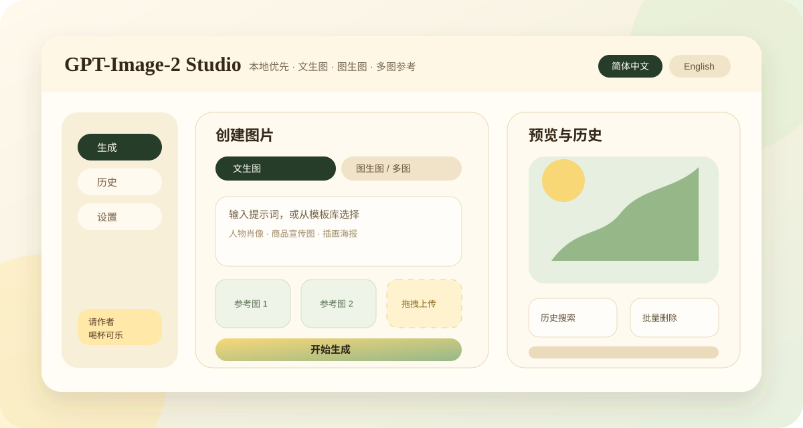

# GPT-Image-2 Studio

A lightweight, ready-to-use image generation tool for `gpt-image-2`.

It is built for people who already have an OpenAI-compatible `API key` and want a simple UI for text-to-image, image-to-image, and batch generation without running a backend service.

[简体中文](./README.md)

[](https://github.com/KDB-Wind/gpt-image-2-studio/actions/workflows/ci.yml)
[](https://github.com/KDB-Wind/gpt-image-2-studio/actions/workflows/pages.yml)
[](https://github.com/KDB-Wind/gpt-image-2-studio/actions/workflows/release.yml)
[](./LICENSE)



## Try It First

The fastest way is the hosted static page:

[https://kdb-wind.github.io/gpt-image-2-studio/](https://kdb-wind.github.io/gpt-image-2-studio/)

There is no backend service behind this page. Requests are sent directly from your browser to the `Base URL` you enter, and your settings stay in your own browser.

First use:

1. Open the hosted page.
2. Go to Settings.
3. Fill in your own `API key`, `Base URL`, text model, and image model.
4. Save settings.
5. Test the text model and image model before generating images.

If you do not have a model provider yet, you may check the author's recommended relay:

[https://ruoli.dev/register?aff=mR35](https://ruoli.dev/register?aff=mR35)

Please evaluate provider stability, pricing, and compliance yourself. This repository does not include any real `API key`.

## Offline Single-File HTML

For local use, download the single-file HTML:

1. Open [Releases](https://github.com/KDB-Wind/gpt-image-2-studio/releases).
2. Download `gpt-image-2-studio-lite.html` from the latest release.
3. Open it with Edge or Chrome.
4. Fill in your own API settings.

Do not download the root `index.html` from the source file list. That file is only the development entry. The directly usable file is the release asset named `gpt-image-2-studio-lite.html`.

## What It Can Do

Generate:

- Generate images from prompts.
- Upload 1 to 8 reference images for image-to-image or multi-image reference generation.
- Drag and drop images.
- Configure size, quality, format, and compression.

Batch:

- Generate multiple variants from the same prompt.
- Enter multiple different prompts and process them as one batch.
- Configure concurrency, interval, and retry count.
- Review completed batch results in local history.

History:

- Keep generated results locally.
- Search, filter, view, and delete history items.
- History stays in the current browser and is not uploaded to a project server.

Settings:

- Save `API key`, `Base URL`, model names, timeout, and default image options.
- Test text and image models before using them.

## Notes

Whether the static page can call your model provider depends on the provider's browser CORS policy.

If you see a CORS error, the browser is blocking the request. This usually requires a CORS-compatible provider, the desktop app, or your own proxy.

Image generation can be slow. Some models may need 1 to 3 minutes for one image, so set a long enough timeout.

Failed image requests may still cost money if the provider has already accepted the request. Test with small batches first.

## Privacy And Security

- Do not commit real `API key` values to the repository, issues, screenshots, or logs.
- The hosted page and offline HTML store settings in your current browser only.
- Local `file://` HTML and the hosted GitHub Pages site have separate browser storage.
- Do not save keys on shared computers.
- This project does not host, collect, or proxy your `API key`.
- This project does not include third-party analytics scripts.

## Local Development

For developers:

```powershell
npm install
npm run dev
```

Then open the address shown by Vite, usually:

```text
http://localhost:5173/
```

Build the single-file HTML:

```powershell
npm run build:static
npm run site:check
```

Common checks:

```powershell
npm run test:run
npm run build
```

## Docs

- [Static HTML User Guide](./docs/user-guide-static-html.en-US.md)
- [Basic Tool User Guide](./docs/user-guide-basic-tool.en-US.md)
- [Static Site Hosting Guide](./docs/static-site-hosting.en-US.md)
- [FAQ](./docs/faq.md)
- [Release Guide](./docs/release.en.md)

## License

MIT
