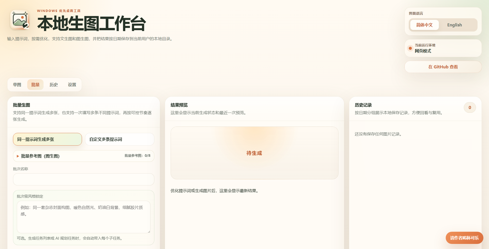

# GPT-Image-2 Studio

一个轻量的 `gpt-image-2` 生图工具台。打开网页，填入自己的 `API key` 和 `Base URL`，就可以做单图、图生图和批量生图。

它不提供后端服务。你的 API key 只会随请求发送到你填写的 `Base URL`。

[English](./README.en.md)

[](https://github.com/KDB-Wind/gpt-image-2-studio/actions/workflows/ci.yml)
[](https://github.com/KDB-Wind/gpt-image-2-studio/actions/workflows/pages.yml)
[](https://github.com/KDB-Wind/gpt-image-2-studio/actions/workflows/release.yml)
[](./LICENSE)



## 先打开试用

在线静态页：

[https://kdb-wind.github.io/gpt-image-2-studio/](https://kdb-wind.github.io/gpt-image-2-studio/)

如果你想放在本地用，可以到 [Releases](https://github.com/KDB-Wind/gpt-image-2-studio/releases) 下载 `gpt-image-2-studio-lite.html`，用 Edge 或 Chrome 直接打开。

第一次使用：

1. 进入「设置」。
2. 填写自己的 `API key`、`Base URL`、文字模型名和图片模型名。
3. 根据需要设置输出目录、超时时间、图片尺寸和质量。
4. 点击「保存配置」。
5. 先测试文字模型和图片模型，再开始正式生成。

如果你还没有可用的模型服务，可以参考作者的可选中转站推荐：

[https://ruoli.dev/register?aff=mR35](https://ruoli.dev/register?aff=mR35)

你也可以使用任何兼容的 `Base URL`。请自行判断服务稳定性、价格和合规性。本仓库不会内置任何真实 `API key`。

## 批量生图

批量页适合一次准备多张图，然后按你设置的节奏逐张或并发生成。它主要有两种用法。

### 同一提示词生成多张

适合做同一主题的多张变体，例如「生成 5 张不同构图的产品海报」。

1. 选择「同一提示词生成多张」。
2. 填写主提示词和任务数量。
3. 如需统一风格，可以填写「批次级风格锁定」。
4. 点击「生成任务列表」，检查每个子任务的标题、提示词和图片名称。
5. 确认无误后点击「开始批量生成」。

如果主提示词本身包含多个主体，例如「为法国、日本、韩国、巴西分别生成世界杯海报」，可以点击「调用文字模型拆分」。工具会调用你配置的文字模型，把主任务拆成多条可编辑的子提示词，并尽量自动判断更合适的任务数量。

### 自定义多条提示词

适合一次执行多张完全不同的图，例如一张产品图、一张头像、一张封面图。

1. 选择「自定义多条提示词」。
2. 每个输入框填写一条提示词。
3. 通过任务数量、加号或减号增减输入框，最多 20 条。
4. 点击「生成任务列表」。
5. 检查后点击「开始批量生成」。

### 批量执行设置

- `并发数`：同时发起多少个图片请求。并发越高，对供应商压力越大，也更容易触发限流。
- `间隔秒数`：每批请求之间等待多久。供应商不稳定时建议加大间隔。
- `失败重试`：单个子任务失败后最多自动重试几次。

建议第一次先用 2 到 4 个任务小批量测试。图片生成失败也可能产生接口费用，尤其是供应商已经接收请求但返回异常内容时。

### 批量图生图

批量页也支持参考图：

- 「批量参考图（图生图）」会把同一组参考图发送给每个子任务。
- 每个子任务也可以单独展开，上传自己的参考图。
- 单个任务最多按当前限制上传 8 张参考图，但供应商是否支持多图取决于它自己的模型能力。

生成过程中，右侧「结果预览」会显示批量进度、最新完成图片和缩略图。完成后的图片和提示词会进入「历史」。

## 单图、历史和设置

「单图」适合临时生成一张图，也支持上传参考图做图生图。

「历史」会保存本地生成记录，方便回看、复用提示词和打开已保存图片。历史记录只保存在当前浏览器本地。

「设置」用于保存模型配置、默认图片参数、批量默认值和输出目录。网页模式下，如果想恢复历史图片预览，需要使用浏览器的目录授权能力；只手动输入 `C:\...` 路径并不等于授权浏览器读取本地文件。

## 需要注意

- 静态网页能否直接调用模型服务，取决于供应商是否允许浏览器跨域请求，也就是 CORS。
- 如果出现 CORS 错误，通常需要换一个支持浏览器访问的供应商，或使用自己的代理。
- 标准接口请保持“官方 GPT Image 模式”；只有兼容中转明确要求时，才启用“强制 base64”。
- 超时时间可设为 60 到 600 秒。快速 1K 测试可以短一些；2K/4K 或供应商较慢时，建议用 180 到 300 秒，避免本地提前中断。
- 在线静态页和本地 `file://` HTML 是不同浏览器来源，配置不会互通。
- 不要把真实 `API key` 发到 Issue、截图、日志或提交记录里。

## 最小 API 调用示例

如果你只是想了解这个页面背后实际发送了什么请求，可以参考下面这段最小示例。它不依赖本项目，也可以改造成自己的脚本或工作流。

```js
const baseUrl = "https://your-provider.example/v1";
const apiKey = "YOUR_API_KEY";

const response = await fetch(`${baseUrl.replace(/\/$/, "")}/images/generations`, {
  method: "POST",
  headers: {
    Authorization: `Bearer ${apiKey}`,
    "Content-Type": "application/json",
  },
  body: JSON.stringify({
    model: "gpt-image-2",
    prompt: "生成一张暖色自然光的咖啡海报",
    size: "1024x1024",
    quality: "auto",
    n: 1,
  }),
});

const data = await response.json();
const imageBase64 = data.data?.[0]?.b64_json;
console.log(imageBase64 ? "图片已返回" : data);
```

如果在浏览器里直接运行这段代码，供应商需要允许 CORS；如果放在 Node.js、本地脚本或自己的后端里调用，则不受浏览器 CORS 限制。

## 本地开发

```powershell
npm install
npm run dev
```

构建单文件 HTML：

```powershell
npm run build:static
npm run site:check
```

常用检查：

```powershell
npm run test:run
npm run build
```

## 文档

- [静态 HTML 使用指南](./docs/user-guide-static-html.zh-CN.md)
- [基础工具版使用指南](./docs/user-guide-basic-tool.zh-CN.md)
- [静态站发布指南](./docs/static-site-hosting.zh-CN.md)
- [FAQ](./docs/faq.md)
- [Release 指南](./docs/release.md)

## License

MIT
